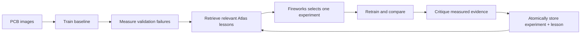
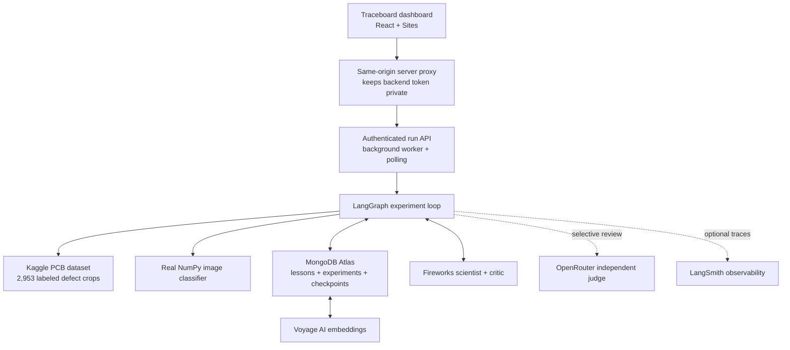

# Traceboard — Self-Improving PCB Defect Agent

[](https://www.python.org/)
[](https://www.mongodb.com/atlas)
[](https://www.langchain.com/langgraph)
[](https://fireworks.ai/)

Traceboard is an autonomous experimentation system for PCB defect classification.
It trains a real image model, measures where it fails, retrieves relevant lessons
from previous runs, asks an AI scientist to select one bounded intervention,
re-trains, critiques the measured result, and writes the new evidence back to
MongoDB Atlas.

The classifier is the workload. The product is the learning loop around it.

**Live dashboard:** [traceboard-pcb-lab.aamjad52114.chatgpt.site](https://traceboard-pcb-lab.aamjad52114.chatgpt.site/)

> The hosted dashboard uses the live backend while the demo service is online.
> If it cannot reach the backend, it clearly switches to an interactive `Demo`
> mode instead of presenting simulated activity as live.

## One-minute product story



1. Start a cold or memory-enabled campaign.
2. Train a baseline classifier on the real PCB training split.
3. Evaluate macro F1, accuracy, per-class precision/recall/F1, confusion matrix,
   training history, and misclassified examples on validation data.
4. Convert the current failure pattern into a retrieval query.
5. Use Voyage embeddings plus MongoDB Atlas Vector Search and lexical Search to
   retrieve useful past lessons.
6. Ask Fireworks AI for exactly one schema-validated, allowlisted experiment.
7. Retrain with that intervention and compare measured results.
8. Ask the critic to turn the result—successful or failed—into reusable evidence.
9. Persist the linked experiment and lesson, checkpoint the graph, and repeat
   until the target or experiment budget is reached.
10. Retrain the selected configuration and evaluate the untouched test split only
    after optimization ends.

## Why MongoDB is central

MongoDB is not a passive event log in this project. It is the agent's persistent
context and recovery layer.

| MongoDB capability | How Traceboard uses it |
| --- | --- |
| Atlas document collections | Store structured experiments, outcomes, lessons, run summaries, and evidence |
| Atlas Vector Search | Retrieve semantically similar failure/intervention lessons using 1,024-dimensional Voyage embeddings |
| Atlas Search | Add lexical relevance for defect names, interventions, and result language |
| Hybrid retrieval | Blend semantic and lexical ranks while filtering by outcome, defect family, or run |
| Atomic transactions | Commit the experiment and its derived lesson as one linked unit |
| MongoDB LangGraph checkpointer | Resume interrupted campaigns with the exact graph state and thread ID |
| Aggregation pipelines | Compare cold and memory-assisted runs and surface the best interventions |
| Schema validation and indexes | Keep agent-written memory consistent, attributable, and queryable |

Every lesson keeps a real `lesson_id`. The Fireworks scientist can cite only IDs
that were actually presented in the retrieval context, so the dashboard can show
which stored experience influenced a decision.

## End-to-end architecture



### Component responsibilities

- **LangGraph orchestrator:** owns state transitions, experiment budget, stop
  conditions, checkpointing, cold/memory modes, and selective judge routing.
- **MongoDB memory:** owns durable experiments and lessons, hybrid retrieval,
  run analytics, schema/index bootstrap, and atomic experience commits.
- **Fireworks reasoning:** diagnoses measured failures, proposes a single safe
  action, and critiques the result with strict Pydantic structured output.
- **OpenRouter judge:** provides a second opinion only for low confidence,
  repeated failure, model-family changes, proposal reconsideration, or a final
  lesson. The loop continues safely when the optional judge is unavailable.
- **ML adapter:** loads real image crops, extracts deterministic image features,
  trains a mini-batch softmax classifier with NumPy, persists model artifacts,
  and reports validation/test evidence.
- **Dashboard and API:** launch background runs, poll real graph state, and
  visualize stages, metrics, memory citations, interventions, and lessons.

## Real dataset and leakage controls

The preparation pipeline downloads the public Kaggle PCB Defects dataset
(`akhatova/pcb-defects`) and converts Pascal VOC bounding boxes into a
classification workload.

| Property | Value |
| --- | ---: |
| Original source images | 693 |
| Labeled defect objects/crops | 2,953 |
| Defect classes | 6 |
| Training records | 2,059 |
| Validation records | 447 |
| Untouched test records | 447 |

Classes are `missing_hole`, `mouse_bite`, `open_circuit`, `short`, `spur`, and
`spurious_copper`. The split is deterministic, stratified, and grouped by source
image. No source-image group crosses train, validation, or test, and rotated
derivatives are excluded to avoid correlated duplicates. Optimization uses only
the validation split; the final test helper retrains on training data and opens
the test split after the graph completes.

Prepare the dataset once:

```powershell
python -m scripts.prepare_pcb_dataset
```

Generated crops, manifests, and model files stay local and are excluded from Git.

## Safety and experiment controls

The reasoning model cannot execute arbitrary code or invent unrestricted
hyperparameters. Proposals are constrained to this action allowlist:

- change model family
- change learning rate
- change batch size
- change image size
- change augmentation
- change sampler
- change class weights
- change confidence threshold
- increase epochs

Unknown fields and unsupported action parameters are rejected. Each proposal
includes a diagnosis, hypothesis, reasoning summary, confidence, and the exact
memory IDs used. Fireworks retries bounded repairable output failures; graph
state, budget limits, and deterministic routing remain authoritative.

The HTTP API also requires a bearer token, validates request fields and run
modes, caps request bodies and worker concurrency, binds to loopback in the demo
launcher, and never exposes provider keys to browser JavaScript.

## Quick start

### 1. Install

```powershell
git clone https://github.com/ali-amjad52114/pcb-self-improving-agent.git
cd pcb-self-improving-agent
python -m venv .venv
.\.venv\Scripts\Activate.ps1
python -m pip install -e .
python -m pip install pytest
Copy-Item .env.example .env
```

Python 3.12 or newer is required. Node.js 22 or newer is required only for the
dashboard.

### 2. Run locally with deterministic adapters

Fake mode exercises the complete graph without external credentials:

```powershell
python -m pcb_agent.runner start --run-id local_demo --mode memory
python -m pcb_agent.runner status --run-id local_demo
python -m pcb_agent.runner resume --run-id local_demo
```

### 3. Configure the integrated system

Set these values in `.env`:

```env
AGENT_MODE=integrated
ML_MODULE=pcb_agent.integrations.pcb_ml
REASONING_MODULE=fireworks
MEMORY_MODULE=pcb_memory.memory
CHECKPOINTER_BACKEND=mongodb

MONGODB_URI=mongodb+srv://...
MONGODB_DB=persistent_context
MONGODB_DB_NAME=persistent_context
VOYAGE_API_KEY=...

FIREWORKS_API_KEY=...
FIREWORKS_MODEL=accounts/fireworks/models/gpt-oss-20b

OPENROUTER_ENABLED=true
OPENROUTER_API_KEY=...
OPENROUTER_MODEL=...

PCB_DATASET_MANIFEST=data/pcb_splits.json
PCB_MODEL_DIR=data/models
EXPERIMENT_BUDGET=4
TARGET_METRIC=macro_f1
TARGET_VALUE=0.84
```

Never commit `.env` or provider credentials.

Bootstrap Atlas schemas, indexes, and seed memory:

```powershell
python -m scripts.bootstrap_memory
```

Run comparable campaigns:

```powershell
python -m pcb_agent.runner start --run-id cold_001 --mode cold
python -m pcb_agent.runner start --run-id memory_001 --mode memory
```

Cold mode skips retrieval but still stores new experience. Memory mode retrieves
Atlas lessons and exposes exactly which ones changed or supported the proposal.

### 4. Run the authenticated API

```powershell
$env:PCB_API_TOKEN = '<high-entropy-token>'
python -m pcb_agent.api --host 127.0.0.1 --port 8000
```

API surface:

| Method | Endpoint | Purpose |
| --- | --- | --- |
| `GET` | `/health` | Service health |
| `POST` | `/runs` | Start a cold or memory run and return immediately |
| `GET` | `/runs` | List active and completed runs |
| `GET` | `/runs/{run_id}` | Poll status, current stage, metrics, and state |
| `GET` | `/runs/{run_id}/state` | Read the JSON-safe graph state |
| `GET` | `/runs/{run_id}/history` | Read durable run history |

All endpoints also have `/api/...` aliases and require the bearer token.

### 5. Run the dashboard

```powershell
cd dashboard
npm install
$env:BACKEND_BASE_URL = 'http://127.0.0.1:8000'
$env:BACKEND_TOKEN = '<same-token>'
npm run dev
```

The browser calls a same-origin `/api/backend/*` route. That server-side route
adds the bearer token and proxies to the Python service, so secrets never enter
the client bundle.

## Demo flow for judges and sponsors

1. Open the dashboard and point out the `Live API` badge. `Demo` means the
   backend is unavailable and the interface is intentionally using fallback data.
2. Keep **Experienced agent** enabled and click **Start autonomous run**.
3. Watch the graph advance from real data to baseline training and validation.
4. Open the memory stage and show the retrieved Atlas lesson IDs and which IDs
   Fireworks actually cited.
5. Show the selected allowlisted intervention and confidence.
6. Watch the measured delta and per-class F1 change after retraining.
7. Show the critic's reusable lesson and explain that it is stored even when the
   experiment fails—negative evidence prevents repeating bad ideas blindly.
8. Resume the same run ID to demonstrate MongoDB-backed graph recovery.
9. Compare a cold run with a memory run to show how persistent context changes
   decisions, without promising that every individual experiment must improve.

## Observability

LangGraph can emit native traces to LangSmith without changing execution:

```env
LANGSMITH_API_KEY=...
LANGSMITH_TRACING=true
LANGSMITH_PROJECT=pcb-self-improving-agent
```

Tracing is optional and observability-only. Leave `LANGSMITH_TRACING=false` when
no key is configured; a tracing outage must not control experiment routing,
training, or Atlas persistence.

## Validation

```powershell
pytest -q tests fireworks/tests
cd dashboard
npm test
```

Coverage includes graph routing and stop conditions, fake end-to-end campaigns,
MongoDB integration contracts, Atlas bootstrap behavior, OpenRouter policy,
Fireworks structured scenarios, real ML training/evaluation, API authentication
and run lifecycle, plus a production dashboard build and rendered-page test.

## Repository map

```text
pcb_memory/                 Atlas client, schemas, hybrid retrieval, persistence
fireworks/                  Scientist, critic, prompts, structured-output client
src/pcb_agent/              LangGraph state, nodes, routing, adapters, CLI, API
src/pcb_agent/integrations/ Real ML adapter and external service adapters
scripts/                    Dataset preparation, Atlas bootstrap, demo launchers
configs/                    Baseline experiment configuration
dashboard/                  React observability dashboard and secure API proxy
tests/                      Orchestration, memory, ML, routing, and API tests
```

## Current scope

Traceboard is a hackathon-grade reference implementation, not a production PCB
inspection system. Its real NumPy classifier keeps the end-to-end experiment
loop fast and auditable on a laptop; the adapter boundary is designed so a CNN
or production training service can replace it without changing LangGraph,
MongoDB memory, reasoning contracts, API semantics, or the dashboard.

The key result is durable learning at the system level: every run produces
measured, attributable context that can improve the quality of the next decision.
